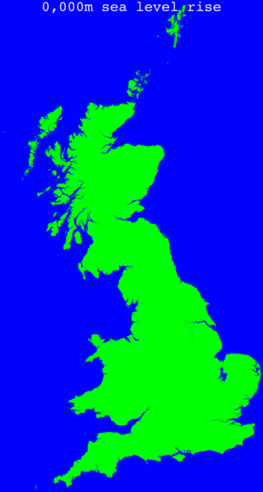

# Rising Sea Levels (RSL)

This project aims to map the effects of rising sea levels on Great Britain.

## Workflow

1. Download for yourself [the "OS Terrain 50" dataset](https://www.ordnancesurvey.co.uk/business-and-government/products/terrain-50.html), in the "ASCII Grid and GML (Grid)" file format, from the Ordnance Survey to provide the "terr50_gagg_gb.zip" file that is used here
2. Convert the ZIP file of [the "OS Terrain 50" dataset](https://www.ordnancesurvey.co.uk/business-and-government/products/terrain-50.html) to a BIN file (by running [step2_convertZIPtoBIN.py](step2_convertZIPtoBIN.py))
3. Compile the FORTRAN programs (by running [src/Makefile](src/Makefile))
4. Create an elevation map of Great Britain (by running [src/convertBINtoPPM](src/convertBINtoPPM.F90))
5. Flood Great Britain (by running [src/createFlood](src/createFlood.F90))
6. Convert all generated PPM images to PNG images (by running [step6_convertPPMtoPNG.sh](step6_convertPPMtoPNG.sh))
7. Convert the sequence of PNG images to a MP4 video (by running [step7_convertPNGtoMP4.py](step7_convertPNGtoMP4.py))
8. Convert the sequence of PNG images to a WEBP animation (by running [step8_convertPNGtoWEBP.py](step8_convertPNGtoWEBP.py))

## Method

The method that is used here has been stolen from [Where Can Pregnant Women Go? (WCPWG)](https://github.com/Guymer/wcpwg) as it is exactly the same numerical problem.

## Dependencies

RSL requires the following Python modules to be installed and available in your `PYTHONPATH`.

* [cartopy](https://pypi.org/project/Cartopy/)
* [numpy](https://pypi.org/project/numpy/)
* [pyguymer3](https://github.com/Guymer/PyGuymer3)
* [shapefile](https://pypi.org/project/pyshp/)

Additionally, due to the dependency on [my FORTRAN library](https://github.com/Guymer/fortranlib), you will also require the following Python modules to be installed and available in your `PYTHONPATH`:

* [matplotlib](https://pypi.org/project/matplotlib/)
* [scipy](https://pypi.org/project/scipy/)

RSL uses some [Global Self-Consistent Hierarchical High-Resolution Geography](https://www.ngdc.noaa.gov/mgg/shorelines/) resources and some [Natural Earth](https://www.naturalearthdata.com/) resources via the [cartopy](https://pypi.org/project/Cartopy/) module. If they do not exist on your system then [cartopy](https://pypi.org/project/Cartopy/) will download them for you in the background. Consequently, a working internet connection may be required the first time you run RSL.

## Bugs

* If you look at the image with a sea level of 0m (shown below) then you will notice that there are some large lakes in East Anglia that are not there in real life. In real life they are below sea level, with [Holme Fen](https://en.wikipedia.org/wiki/Holme_Fen) being the lowest point in GB. However, in real life there are numerous dykes that keep the sea out so that these low-lying areas are not flooded. [The "OS Terrain 50" dataset](https://www.ordnancesurvey.co.uk/business-and-government/products/terrain-50.html) is gridded on 50m by 50m pixels, therefore, I conclude that the reason why I am incorrectly flooding these areas with a sea level of 0m is because the dykes that keep the water out are less than 50m by 50m in real life.

